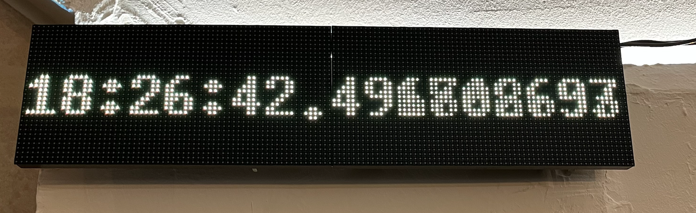
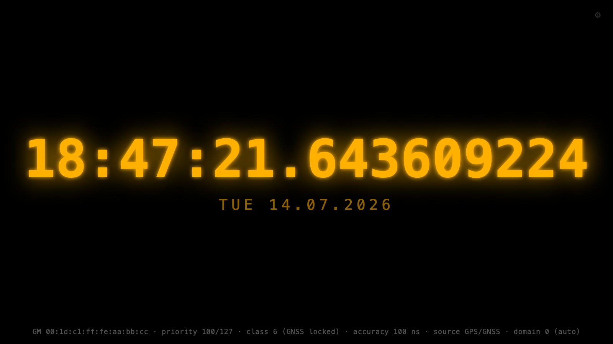
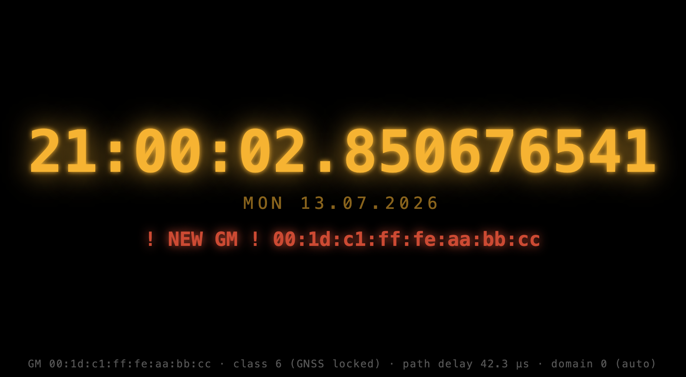
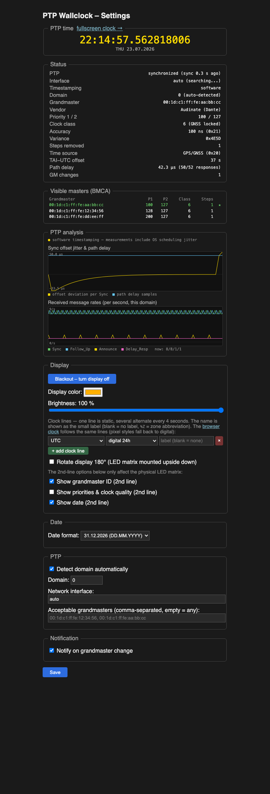

# ptp-wallclock

[](https://github.com/Gemini2350/ptp-wallclock/actions/workflows/docker-publish.yml)
[](https://hub.docker.com/r/gemini2350/ptp-wallclock)

<p align="center"></p>

# ptp-wallclock

`ptp-wallclock` is a C++ application for Raspberry Pi that acts as a PTP
(IEEE 1588 Precision Time Protocol, PTPv2) client and displays the
synchronized wall-clock time on an attached LED matrix display — or, in
headless/Docker mode, as a fullscreen clock in the browser.

The project is intended as a lightweight, hardware-based visualization of PTP
time synchronization, useful for experiments, demos, and educational purposes.
I've used it to demonstrate that PTP is really distributing the Time at my Speech at Chaos Computer Club,
[Excuse me, what precise time is It?](https://media.ccc.de/v/39c3-excuse-me-what-precise-time-is-it).

---

## Features

- Real PTPv2 (IEEE 1588) client with the end-to-end delay mechanism:
  Sync / Follow_Up are correlated with their local arrival time, Delay_Req /
  Delay_Resp measure the network path delay, and the displayed time is
  corrected accordingly (correction fields included, one-step and two-step
  masters supported)
- Best Master Clock Algorithm (BMCA): every master announcing in the domain
  is tracked, the best one is elected via the IEEE 1588 dataset comparison
  (priority 1, clock class, accuracy, variance, priority 2, identity — and
  steps removed for redundant paths to the same grandmaster). Announce
  receipt timeouts are honored, so the clock fails over automatically
- Automatic PTP domain detection (locks onto the first domain with Announce
  traffic, rescans on timeout), or a fixed domain 0–255
- Displays time on an RGB LED matrix (UTC, TAI, or local time zone)
- Optional second display line: date, grandmaster ID and/or priorities &
  clock quality (alternating every 4 seconds)
- Grandmaster changes are shown on the display itself ("! NEW GM !")
- Built-in web interface (port 8319) for settings and live status —
  grandmaster identity, priority 1/2, clock class, clock accuracy, variance,
  steps removed, time source, TAI−UTC offset, and measured path delay
- Grandmaster change notification (web + red highlight on the matrix)
- One-step installation with systemd service
- Headless mode for Docker: a fullscreen browser clock (`/clock`) replaces
  the LED panel
- Runs entirely in user space, no kernel PTP support needed

---

## Hardware Requirements

These are only needed for the physical LED clock — the
[Docker version](#docker--no-led-hardware-needed) has no hardware
requirements and runs anywhere Docker runs; all it needs is a network that
carries PTP.

- Raspberry Pi (tested on Raspberry Pi 3/4 - 5 not working at the moment)
- RGB LED matrix compatible with the `rpi-rgb-led-matrix` library
-- [Adafruit RGB Matrix HAT](https://www.adafruit.com/product/2345)
-- 2 x [HUB75 LED Panel 32x64 Pixel](https://www.waveshare.com/RGB-Matrix-P3-64x32.htm) (32 x 128 total)
- Network interface receiving PTP packets (typically Ethernet)
- PTP-capable network environment (PTP grandmaster or PTP-enabled switch)

---

## Installation

### Installer script (recommended)

On a Raspberry Pi OS system, one command does everything (fetches and builds
the `rpi-rgb-led-matrix` library, compiles the clock, installs fonts and a
systemd service that starts on boot):

```bash
git clone https://github.com/Gemini2350/ptp-wallclock.git
cd ptp-wallclock
sudo ./install.sh
```

Afterwards:

```bash
systemctl status ptp-wallclock     # service status
journalctl -u ptp-wallclock -f     # logs
```

The settings page is served on `http://<pi-address>:8319`.

### Manual build

If you prefer to build by hand (with the matrix library in
`/opt/rpi-rgb-led-matrix`, or pass `MATRIX_DIR=`):

```bash
make
sudo ./ptp-clock
```

### Docker — no LED hardware needed

The clock also runs headless in a container: the PTP client and web
interface are identical, and the LED panel is replaced by a fullscreen
browser clock at `http://<host>:8319/clock` — glowing digits in the
configured color with all nine fractional digits, date, grandmaster status
line, and the GM change alert. Brightness and blackout from the settings
page apply to it too. Click the page to go fullscreen.

<p align="center"></p>

Prebuilt multi-arch images (amd64, arm64, arm/v7) are on Docker Hub as
[`gemini2350/ptp-wallclock`](https://hub.docker.com/r/gemini2350/ptp-wallclock),
built by CI from this repository:

```bash
docker compose up -d
```

or manually:

```bash
docker run -d --network host \
    -v ptp-wallclock:/var/lib/ptp-wallclock \
    --name ptp-wallclock gemini2350/ptp-wallclock
```

To build the image yourself instead: `docker build -t ptp-wallclock .`

Notes:

- `--network host` is required so the container receives the PTP multicast
  on UDP 319/320 — this works on Linux hosts (Docker Desktop on
  macOS/Windows does not pass host multicast through).
- The PTP interface is auto-detected by default (the clock joins the
  multicast group on every interface with an IPv4 address). To pin it, set
  `-e PTP_WALLCLOCK_IFACE=eth0` or change it in the web UI (the volume
  keeps the settings).
- The same headless binary can be built without Docker: `make headless`.

---

## Web Interface

The clock serves a settings page on `http://<pi-address>:8319`. At the top
it shows the current PTP time as a live, smoothly ticking clock with all
nine fractional digits, just like the matrix (the server sends its TAI time
with every status poll and the browser extrapolates in between; expect a few
milliseconds of network offset, so the fast digits are extrapolated rather
than measured — digits finer than the browser's timer resolution are
dithered every frame so they spin like on the LED panel instead of
freezing). The clock follows the
configured time mode and formats, so it mirrors what the LED matrix shows.
Settings:

- **Display color** — color picker for the LED matrix text
- **Brightness** — 1–100 % slider, applied immediately
- **Blackout** — one-click switch to temporarily turn the display off
  (the clock keeps tracking PTP in the background)
- **Grandmaster ID** — show the current PTP grandmaster identity as a second
  line on the matrix
- **Priorities & clock quality** — show priority 1/2, clock class and clock
  accuracy on the matrix
- **Date** — show the date on the matrix (if several second-line options are
  enabled, the line alternates every 4 seconds)
- **Time display** — UTC, TAI, or local time with a configurable time zone
  (IANA names such as `Europe/Berlin`), 24-hour or 12-hour (AM/PM) format
- **Date format** — `DD.MM.YYYY`, ISO 8601 (`YYYY-MM-DD`), or `MM/DD/YYYY`
- **PTP domain** — automatic detection (default) or a fixed domain number
  (0–255); the detected domain is shown in the status panel
- **Network interface** — selectable from the interfaces present on the
  system, applied without restart
- **Grandmaster change notification** — when enabled, a grandmaster change
  shows `! NEW GM !` in red on the matrix (and on the browser clock) for
  10 seconds and triggers a browser notification / banner on the settings
  page:

<p align="center"></p>

The status panel shows live data decoded from the Announce messages
(grandmaster identity, priorities, clock class/accuracy/variance, steps
removed, time source), the TAI−UTC offset, and the measured mean path delay
with a Delay_Req/Delay_Resp counter. A separate table lists all masters
currently visible in the domain with the BMCA-elected one marked — handy for
watching a failover happen.

> Note: browser push notifications require the page to be allowed to notify;
> on plain HTTP some browsers only show the in-page banner.

<p align="center"></p>

## Configuration file

Settings are persisted as simple `key=value` pairs. The file is
`/var/lib/ptp-wallclock/ptp-wallclock.conf` when installed via `install.sh`,
otherwise `ptp-wallclock.conf` in the working directory (override with the
`PTP_WALLCLOCK_CONF` environment variable). One setting is only available
in the file (restart required):

| Key         | Default | Meaning                              |
|-------------|---------|--------------------------------------|
| `http_port` | `8319`  | Port of the web interface            |

The network interface (`iface`, default `auto`) can be changed in the web
interface without a restart. In `auto` mode the clock joins the PTP
multicast group on every interface that has an IPv4 address (re-checked
every 5 seconds, so interfaces that appear late — DHCP at boot, hotplug —
are picked up automatically). Pinning it to one interface name switches
the membership over immediately.

## Privileged ports (why sudo?)

PTP uses UDP ports 319 and 320, which are privileged ports on Linux. The
systemd service handles this cleanly: it starts as root, binds the PTP ports
and initializes the GPIO, and then the `rpi-rgb-led-matrix` library drops
privileges to the `daemon` user by itself. No `sysctl` tweaking is needed.

For manual runs you can either use `sudo ./ptp-clock` (recommended for best
matrix performance) or grant the binary the bind capability once:

```bash
sudo setcap cap_net_bind_service+ep ./ptp-clock
./ptp-clock
```

If binding fails, the program now exits with exactly this hint instead of
silently misbehaving.

## Accuracy

Packets are timestamped in user space (no hardware timestamping), so the
achievable accuracy is in the sub-millisecond range on a Raspberry Pi —
plenty for a wall clock display, but this is a visualization tool, not a
reference clock. Sync/Follow_Up and Delay_Resp measurements are smoothed
with a small exponential filter.

## References

[Excuse me, what precise time is It?](https://media.ccc.de/v/39c3-excuse-me-what-precise-time-is-it).

## Open Issues

- PTPv1 (IEEE 1588-2002) is not supported. The implementation targets PTPv2
  (IEEE 1588-2008) only.

- Only software timestamps are used (see Accuracy above).
