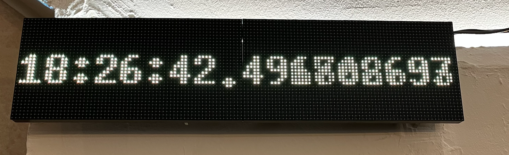
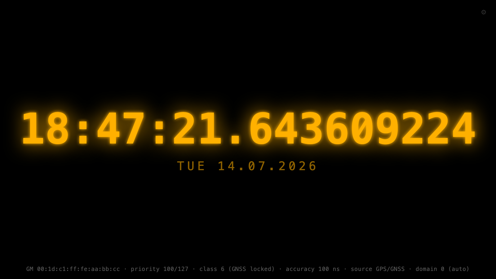
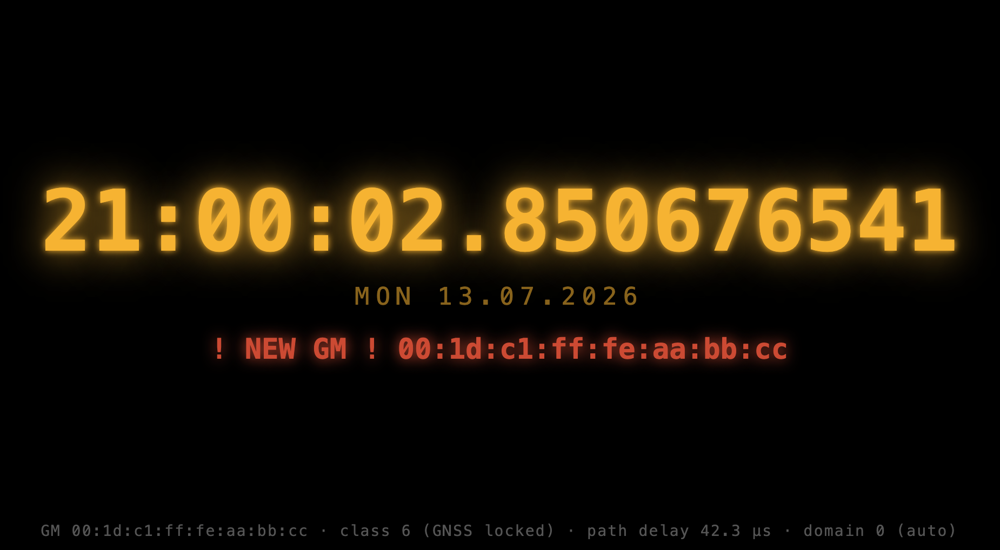
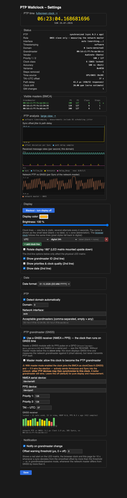

# ptp-wallclock

[](https://github.com/Gemini2350/ptp-wallclock/actions/workflows/docker-publish.yml)
[](https://hub.docker.com/r/gemini2350/ptp-wallclock)

<p align="center"></p>

# ptp-wallclock

`ptp-wallclock` is a C++ application for Raspberry Pi that acts as a PTP
(IEEE 1588 Precision Time Protocol, PTPv2) client and displays the
synchronized wall-clock time on an attached LED matrix display — or, in
headless/Docker mode, as a fullscreen clock in the browser.

The project is intended as a lightweight, hardware-based visualization of PTP
time synchronization, useful for experiments, demos, and educational purposes.
I've used it to demonstrate that PTP is really distributing the Time at my Speech at Chaos Computer Club,
[Excuse me, what precise time is It?](https://media.ccc.de/v/39c3-excuse-me-what-precise-time-is-it).

---

## The three builds

The same binary, three ways to run it — each step adds hardware:

| Build | Hardware | What you get |
|---|---|---|
| **Docker / headless** | none — any Linux box on the PTP network | fullscreen browser clock (`/clock`), full PTP analysis web UI: visible masters, offset/delay/PDV charts, protocol profiles. See [Docker](#docker--no-led-hardware-needed) |
| **LED wallclock** | Raspberry Pi + RGB LED matrix (see [Hardware Requirements](#hardware-requirements)) | the wall clock itself: multi-timezone lines, display styles, GM alerts — plus everything above |
| **Measurement instrument** | CM5 on an IO board + GNSS HAT, one wire and one solder bridge | a GNSS-disciplined reference that measures your grandmaster against GPS truth to ~±¼ µs, and can itself be the grandmaster on all three profiles. See [GNSS grandmaster mode](#gnss-grandmaster-mode) and [The precision build](#the-precision-build-hardware-pps-capture-on-a-cm5) |

The measurement build also works in stages: a GNSS HAT on any Pi gives
the grandmaster + time-error measurement at few-µs accuracy over GPIO
(on a Pi 5 with hardware timestamps: ~±1–3 µs); the CM5 hardware
capture removes the last microseconds.

## Features

- Three protocol profiles, selectable in the web UI: **PTPv2**
  (IEEE 1588 over UDP, default), **gPTP / IEEE 802.1AS** (AVB, Milan —
  v2 messages on raw Ethernet with the peer-delay mechanism; the clock
  answers Pdelay_Req so switches keep it asCapable) and **PTPv1**
  (IEEE 1588-2002 legacy, mapped onto the same BMCA/UI: stratum becomes
  clockClass, the UTC timescale is converted to TAI)
- Real PTPv2 (IEEE 1588) client with the end-to-end delay mechanism:
  Sync / Follow_Up are correlated with their local arrival time, Delay_Req /
  Delay_Resp measure the network path delay, and the displayed time is
  corrected accordingly (correction fields included, one-step and two-step
  masters supported)
- Best Master Clock Algorithm (BMCA): every master announcing in the domain
  is tracked, the best one is elected via the IEEE 1588 dataset comparison
  (priority 1, clock class, accuracy, variance, priority 2, identity — and
  steps removed for redundant paths to the same grandmaster). Announce
  receipt timeouts are honored, so the clock fails over automatically
- Automatic PTP domain detection (locks onto the first domain with Announce
  traffic, rescans on timeout), or a fixed domain 0–255
- PTP hardware timestamping when the NIC has a PHC (e.g. Raspberry Pi 5,
  CM4, Intel i210/i225): Sync arrival and Delay_Req departure are stamped
  by the hardware and the display runs directly off the PTP hardware
  clock — enabled automatically at startup, with transparent fallback to
  software timestamps. The status panel shows which mode is active
- Displays time on an RGB LED matrix as a configurable list of clock lines:
  each line has a time zone (UTC, TAI, or any IANA zone — world clock!), a
  rendering style, and an optional label — one line is static, several
  alternate every 4 seconds.
  Styles: digital 24h/12h, Unix timestamp, binary (BCD), flip clock,
  DCF77 telegram — all with the full nine fractional digits — plus a
  live **PTP stats** view (current path delay, sync jitter as RMS over
  the last minute, message rates) as a display line on the matrix
  itself
- Optional second display line: date, grandmaster ID and/or priorities &
  clock quality (alternating every 4 seconds)
- Grandmaster changes are shown on the display itself ("! NEW GM !")
- **GNSS grandmaster mode**: with a GNSS receiver attached (NMEA + PPS),
  the clock disciplines itself from GPS. By default it stays **slave
  only** and *measures* the network grandmaster against GNSS: a live
  "network PTP vs GNSS" chart shows how far your house grandmaster is
  from GPS truth. A separate, deliberately-confirmed **master mode**
  switch additionally lets it take part in the BMCA as a clockClass 6
  grandmaster — sending Announce and two-step Sync/Follow_Up and
  answering Delay_Req. GNSS status (fix, satellites in view with
  per-satellite signal bars, HDOP, PPS age) is shown in the web UI
- Built-in web interface (port 8319) for settings and live status —
  grandmaster identity, priority 1/2, clock class, clock accuracy, variance,
  steps removed, time source, TAI−UTC offset, and measured path delay
- Grandmaster change notification (web + red highlight on the matrix)
- One-step installation with systemd service
- Headless mode for Docker: a fullscreen browser clock (`/clock`) replaces
  the LED panel
- Runs entirely in user space; kernel PTP (PHC) support is used when
  present but never required

---

## Hardware Requirements

These are only needed for the physical LED clock — the
[Docker version](#docker--no-led-hardware-needed) has no hardware
requirements and runs anywhere Docker runs; all it needs is a network that
carries PTP.

- Raspberry Pi (tested on Raspberry Pi 3/4/5 — Pi 5 works since the
  `rpi-rgb-led-matrix` library gained its RP1 backend; `install.sh` always
  builds the current library)
- RGB LED matrix compatible with the `rpi-rgb-led-matrix` library
-- [Adafruit RGB Matrix HAT](https://www.adafruit.com/product/2345)
-- 2 x [HUB75 LED Panel 32x64 Pixel](https://www.waveshare.com/RGB-Matrix-P3-64x32.htm) (32 x 128 total)
- Network interface receiving PTP packets (typically Ethernet)
- PTP-capable network environment (PTP grandmaster or PTP-enabled switch)

---

## Installation

### Installer script (recommended)

On a Raspberry Pi OS system, one command does everything (fetches and builds
the `rpi-rgb-led-matrix` library, compiles the clock, installs fonts and a
systemd service that starts on boot):

```bash
git clone https://github.com/Gemini2350/ptp-wallclock.git
cd ptp-wallclock
sudo ./install.sh
```

Afterwards:

```bash
systemctl status ptp-wallclock     # service status
journalctl -u ptp-wallclock -f     # logs
```

The settings page is served on `http://<pi-address>:8319`.

### Manual build

If you prefer to build by hand (with the matrix library in
`/opt/rpi-rgb-led-matrix`, or pass `MATRIX_DIR=`):

```bash
make
sudo ./ptp-clock
```

### Docker — no LED hardware needed

The clock also runs headless in a container: the PTP client and web
interface are identical, and the LED panel is replaced by a fullscreen
browser clock at `http://<host>:8319/clock` — glowing digits in the
configured color with all nine fractional digits, date, grandmaster status
line, and the GM change alert. Brightness and blackout from the settings
page apply to it too. Click the page to go fullscreen.

<p align="center"></p>

Prebuilt multi-arch images (amd64, arm64, arm/v7) are on Docker Hub as
[`gemini2350/ptp-wallclock`](https://hub.docker.com/r/gemini2350/ptp-wallclock),
built by CI from this repository:

```bash
docker compose up -d
```

or manually:

```bash
docker run -d --network host --restart unless-stopped \
    -v ptp-wallclock:/var/lib/ptp-wallclock \
    --name ptp-wallclock gemini2350/ptp-wallclock
```

To build the image yourself instead: `docker build -t ptp-wallclock .`

Notes:

- `--network host` is required so the container receives the PTP multicast
  on UDP 319/320 — this works on Linux hosts (Docker Desktop on
  macOS/Windows does not pass host multicast through).
- The PTP interface is auto-detected by default (the clock joins the
  multicast group on every interface with an IPv4 address). To pin it, set
  `-e PTP_WALLCLOCK_IFACE=eth0` or change it in the web UI (the volume
  keeps the settings).
- For PTP hardware timestamping inside the container the NIC's PHC must be
  passed in and the container needs `CAP_NET_ADMIN`:
  `--cap-add NET_ADMIN --device /dev/ptp0` (matching commented lines are
  in `docker-compose.yml`). Without them the container simply uses
  software timestamps.
- For the GNSS grandmaster mode pass the receiver in as well:
  `--device /dev/serial0 --device /dev/pps0`.
- The same headless binary can be built without Docker: `make headless`.

---

## Web Interface

The clock serves a settings page on `http://<pi-address>:8319`. At the top
it shows the current PTP time as a live, smoothly ticking clock with all
nine fractional digits, just like the matrix (the server sends its TAI time
with every status poll and the browser extrapolates in between; expect a few
milliseconds of network offset). The fractional digits — on the LED matrix
and in the browser alike — use a per-position speed ladder: the tenths
digit is the true value, and every further digit visibly changes faster
than the one before it. The real values change far too fast for any
display, so the fast digits are synthesized sample-and-hold; what you see
is an ordered acceleration instead of uniform flicker. Settings:

- **Display color** — color picker for the LED matrix text
- **Brightness** — 1–100 % slider, applied immediately
- **Blackout** — one-click switch to temporarily turn the display off
  (the clock keeps tracking PTP in the background)
- **Rotate 180°** — for LED panels that are mounted upside down, applied
  live without a restart
- **Clock lines** — the list of clocks shown on the LED matrix. Per line:
  time zone (UTC, TAI, or any IANA zone — so a world clock like
  `New York / Zurich / Tokyo` is just three lines), style (digital 24h/12h,
  Unix timestamp, binary BCD, flip clock, DCF77 telegram — all with the
  full nine fractional digits — or one of the two live PTP analysis
  graphs), and an optional label (blank = none, `%Z` = zone abbreviation).
  One line is shown statically, several alternate every 4 seconds —
  PTP-second aligned, like everything else
- **Grandmaster ID** — show the current PTP grandmaster identity as a second
  line on the matrix
- **Priorities & clock quality** — show priority 1/2, clock class, and the
  time source (e.g. `GNSS`) on the matrix
- **Date** — show the date on the matrix (if several second-line options are
  enabled, the line alternates every 4 seconds)
- **Date format** — `DD.MM.YYYY`, ISO 8601, or `MM/DD/YYYY`. The browser
  clock follows the same clock lines as the LED matrix — labels appear
  between time and date, and pixel styles fall back to a digital rendering
- **PTP domain** — automatic detection (default) or a fixed domain number
  (0–255); the detected domain is shown in the status panel
- **Network interface** — selectable from the interfaces present on the
  system, applied without restart
- **Acceptable grandmasters** — optional comma-separated list of grandmaster
  identities (any separator style). If BMCA elects a grandmaster that is not
  on the list, a red `! UNACCEPTED GM !` error appears on the LED matrix and
  the browser clock, and the settings page shows a warning banner. Empty
  list = any grandmaster is fine
- **Grandmaster change notification** — when enabled, a grandmaster change
  shows `! NEW GM !` in red on the matrix (and on the browser clock) for
  10 seconds and triggers a browser notification / banner on the settings
  page:
- **Offset warning threshold** — optional limit in nanoseconds (0 =
  off; a legacy µs config value is converted on load). Whenever a sync
  deviates from the smoothed offset by more than the threshold — or, in
  grandmaster/passive mode, whenever the network master differs from
  GNSS by more than it — a red `! OFFSET +12.3us !` alert (with the
  actual value) shows on the LED matrix, the browser clock, and as a
  banner on the settings page for 10 seconds

<p align="center"></p>

The status panel shows live data decoded from the Announce messages
(grandmaster identity, priorities, clock class/accuracy/variance, steps
removed, time source), the grandmaster's vendor — resolved offline from the
OUI inside its identity via a curated list of common PTP/AV brands — the
TAI−UTC offset, and the measured mean path delay with a
Delay_Req/Delay_Resp counter. A separate table lists all masters
currently visible in the domain with the BMCA-elected one marked — handy for
watching a failover happen.

A **PTP analysis** section charts the last 5 minutes on a true time axis
(one grid line per minute, regardless of the message rate): sync offset
jitter (how far each Sync was off the smoothed estimate) together with the
raw path-delay samples, and the received message rates per second (Sync,
Follow_Up, Announce, Delay_Resp) in the active domain. The charts
auto-scale on percentiles, so the step of a master switch doesn't flatten
the interesting µs range. It also states whether the data comes from
hardware or software timestamps. Clicking a chart (or the *large view*
link) opens a fullscreen version at `/analysis`; the *reset* link clears
the history. On the LED matrix the same live figures are available as
the `PTP stats` clock-line style — current path delay, sync jitter
(RMS over the last minute) and message rates — as an extra alternating
line or a dedicated status display.

> Note: browser push notifications require the page to be allowed to notify;
> on plain HTTP some browsers only show the in-page banner.

<p align="center"></p>

## Configuration file

Settings are persisted as simple `key=value` pairs. The file is
`/var/lib/ptp-wallclock/ptp-wallclock.conf` when installed via `install.sh`,
otherwise `ptp-wallclock.conf` in the working directory (override with the
`PTP_WALLCLOCK_CONF` environment variable). Two settings are only
available in the file (restart required):

| Key         | Default | Meaning                                        |
|-------------|---------|------------------------------------------------|
| `http_port` | `8319`  | Port of the web interface                      |
| `hwts`      | `1`     | Try PTP hardware timestamping, `0` = never     |

The network interface (`iface`, default `auto`) can be changed in the web
interface without a restart. In `auto` mode the clock joins the PTP
multicast group on every interface that has an IPv4 address (re-checked
every 5 seconds, so interfaces that appear late — DHCP at boot, hotplug —
are picked up automatically). Pinning it to one interface name switches
the membership over immediately.

## GNSS grandmaster mode

With a GNSS receiver the wallclock can *be* the PTP grandmaster instead
of just displaying one. It needs two signals from the receiver:

- **NMEA** on a serial port (tells which second it is) — default
  `/dev/serial0`, 9600 baud
- **PPS** on a GPIO (tells exactly when the second starts) — default
  `/dev/pps0`. GPIO PPS timestamps carry the kernel's interrupt latency
  (µs-class); the clock reduces that with a kernel-measured
  PHC↔REALTIME translation (`PTP_SYS_OFFSET_EXTENDED`) and a rolling
  median gate that drops interrupt-latency spikes. On boards whose NIC
  exposes the SYNC_IN pin (CM4/CM5 on an IO board — the Pi 5 Model B
  does not), set the PPS device to `phc`: the pulse is then
  hardware-timestamped by the PHC itself (extts, à la `ts2phc`) with no
  interrupt in the path at all

Example receiver: the Waveshare MAX-M8Q GNSS HAT (PPS on GPIO 18 out of
the box; it stacks under the LED matrix HAT with a stacking header and
conflicts with none of its pins). The OS side is one command:

```bash
sudo ./install.sh --gnss
```

then reboot. This enables the serial port, gives it the good PL011 UART
(`dtoverlay=disable-bt`), loads the `pps-gpio` overlay (GPIO 18 by
default — override with `GNSS_PPS_GPIO=nn`), removes the serial login
console that would eat the NMEA stream, and installs `pps-tools`. All
idempotent, with `.wallclock.bak` backups of the boot files. Verify
with `sudo ppstest /dev/pps0` and `timeout 3 cat /dev/serial0`.

For the last microsecond, `sudo ./install.sh --gnss-tune` installs a
small boot-time service that sets the `performance` CPU governor and
pins the PPS interrupt to CPU 2 (the matrix refresh claims CPU 3) —
idle-state wakeups and frequency scaling otherwise add variable
interrupt latency. Measured on a Pi 5, this visibly tightens the
time-error band. Remember to re-check the **GNSS PPS offset**
calibration after changing tuning: the latency floor moves with it.
Calibration is one click: **Set from current time error** next to the
offset field folds the currently measured mean PTP-vs-GNSS time error
into the offset and restarts the statistics, so the time-error chart
re-centers on zero (needs GNSS lock and a comparison master with at
least 30 Syncs).

Then enable **PTP grandmaster (GNSS)** on the settings page. Activation
is deliberately two-staged:

1. **Use a GNSS receiver** — slave only (the default): the clock runs on
   GNSS time and measures the network grandmaster against it, but never
   transmits PTP itself. Safe on any network.
2. **Master mode** — a separate, explicitly-confirmed switch with a
   warning: only with it enabled does the clock join the BMCA and, if it
   wins, actively send Announce/Sync — other PTP devices may then
   synchronize to it.

What happens with both enabled:

- Each PPS pulse is paired with the following RMC sentence into a time
  sample; the display and web clock run directly on GNSS time
  (the analysis chart then shows the PPS jitter)
- The clock joins the BMCA with clockClass 6 (GNSS locked), accuracy per
  timestamping mode, timeSource GPS, and the configurable priorities. If
  it wins, it transmits Announce + two-step Sync/Follow_Up once per
  second and answers Delay_Req — with hardware TX timestamps on a Pi 5
- If a **better** grandmaster announces (lower priority1, etc.), the
  clock stays passive — and measures that master's Syncs against GNSS.
  The **Time Error** chart and status line show the offset of your
  grandmaster against GPS truth, per Sync (the path delay to it is
  measured with Delay_Req as usual and subtracted). The **GNSS PPS
  offset** setting (ns) calibrates out the antenna cable delay
  (≈5 ns per meter of coax) and receiver bias
- Loses GNSS → clockClass 7 holdover for 5 minutes, then it returns to
  plain client mode; the GNSS status panel shows fix quality, satellites
  used/in view with per-satellite signal-strength bars, HDOP and PPS age
- clockClass 6 usually beats everything on a lab network. Give the clock
  priority1 > your real grandmaster's if you only want the measurement,
  or < if you want it to take over

TAI − UTC (37 s since 2017) is a setting: NMEA carries UTC, PTP runs on
TAI, and the offset is announced to clients. The devices are opened
while the service still runs as root; `install.sh` also installs a udev
rule + group so reopening after the privilege drop works (e.g. USB
receivers being replugged).

### The precision build: hardware PPS capture on a CM5

The GPIO PPS path is limited by interrupt latency (µs-class, and on a
CM5 additionally by slow MDIO clock translation). This build removes
all of it: the GNSS pulse goes into the Ethernet PHY's SYNC pin and is
captured by the **same hardware clock that timestamps the PTP
packets** — no interrupt, no clock translation. Measured on the
reference build: servo residual ≈ ±200 ns RMS, time-error band
≈ ±250 ns against a commercial grandmaster.

**Parts**

| Part | Note |
|---|---|
| Raspberry Pi Compute Module 5 | any variant (Lite boots from microSD). The CM5's BCM54210PE PHY carries the IEEE-1588 engine with the SYNC pin — the Pi 5 Model B does **not** expose that pin; no soldering helps there |
| Waveshare CM5-IO-BASE-B | carrier with NIC; exposes the CM5's `Ethernet_SYNC_OUT` (edge pin 18) on solder pad row H3. Alternatives: CM5-NANO-A (pad H1-1), CM5-NANO-B (H5-1), official CM5IO board (J2 pin 6 — its silkscreen wrongly says 9) |
| Waveshare MAX-M8Q GNSS HAT | NMEA on serial0, PPS on GPIO 18, stacking header, backup battery |
| Active GPS antenna (SMA) | powered by the HAT through the coax; a window sill is usually enough |
| ~10 cm thin wire | one signal wire; ground is shared through the 40-pin stack |
| optional: the LED matrix HAT | the measurement variant also works headless via the web UI |

**The solder bridge (on the GNSS HAT)**

The HAT's edge header P1 (`3V3 VCC 5V 5V GND RXD TXD INT SDA SCL PPS`)
carries the timepulse on its **PPS** pin — but behind a TXS0108 level
shifter powered from the **VCC** pin, which expects an external host
to supply its logic voltage. Stacked on a Pi, nothing does. So:

- bridge **3V3 ↔ VCC** (the two adjacent pins at the end of P1)
- careful: VCC's *other* neighbour is 5V — bridging that one instead
  pushes 5 V pulses toward the PHY. Verify with a meter afterwards:
  VCC against GND must read 3.3 V, and the PPS pin must hop 0↔3.3 V
  once a second (only with a GNSS fix — no fix, no pulse, no PPS LED)

**The wire**

- from P1 **PPS** on the GNSS HAT
- to the **left pad of the H3 row** on the underside of the
  CM5-IO-BASE-B: the three-pad row inside the "IO-VREF" silkscreen
  box, labelled `RUN … GL-EN`. Left pad (next to "RUN") = SYNC input,
  middle pad = GND
- **stay away from the right pad (GL-EN)** — shorting it to ground
  powers the whole module off
- keep the wire short (<15 cm); no extra ground wire needed

**Solder-free variant** — with the official Raspberry Pi CM5 IO Board
instead of the Waveshare carrier, nothing needs soldering:

- the SYNC signal sits on the **populated J2 header, pin 6** (count the
  pins — the numbers printed on the silkscreen next to J2 are
  misleading; the perout test below confirms the right pin before you
  connect anything): a female-female Dupont wire from the GNSS HAT's
  P1 **PPS** pin is all the wiring
- the HAT-side bridge is still required — it powers the HAT's level
  shifter and is independent of the carrier board. If your HAT's P1
  header is populated, a standard 2.54 mm **jumper cap across
  3V3↔VCC** replaces the solder bridge; if P1 is bare pads, it is the
  one solder joint of the build
- the official board is larger and pricier; electrically the result is
  identical (same CM5 PHY, same pin)

**Verify before soldering** that the pad really is the PHY's 1588 pin.
The CM5 has *two* PTP clocks (RP1 MAC + PHY); the PHY is the one named
`bcm_phy_ptp` (usually `/dev/ptp0`, and `ethtool -T eth0` should
already name its index as the timestamp provider). `testptp` comes
from the kernel tree:

```bash
curl -sL https://raw.githubusercontent.com/raspberrypi/linux/rpi-6.12.y/tools/testing/selftests/ptp/testptp.c -o testptp.c && gcc -O2 -o testptp testptp.c
```

```bash
grep . /sys/class/ptp/ptp*/clock_name
sudo ./testptp -d /dev/ptp0 -L 0,2 && sudo ./testptp -d /dev/ptp0 -p 1000000000
```

The pad now toggles once per second (multimeter against the middle GND
pad). Stop with `sudo ./testptp -d /dev/ptp0 -p 0`.

**Verify after soldering** that pulses arrive in the PHC (stop the
wallclock service first — it holds the pin):

```bash
sudo systemctl stop ptp-wallclock
sudo ./testptp -d /dev/ptp0 -L 0,1 && sudo ./testptp -d /dev/ptp0 -e 5
sudo systemctl start ptp-wallclock
```

Five events, exactly one second apart. Then pick `phc` as the **PPS
device** on the settings page and restart the service: the GNSS status
line shows "PPS hardware-stamped by the PHC" plus the live servo
residual, and the u-blox qErr sawtooth correction engages
automatically. Finally set the **GNSS PPS offset** to 0 and, once the
time-error chart has settled, click **Set from current time error**.

## Privileged ports (why sudo?)

PTP uses UDP ports 319 and 320, which are privileged ports on Linux. The
systemd service handles this cleanly: it starts as root, binds the PTP ports
and initializes the GPIO, and then the `rpi-rgb-led-matrix` library drops
privileges to the `daemon` user by itself. No `sysctl` tweaking is needed.

For manual runs you can either use `sudo ./ptp-clock` (recommended for best
matrix performance) or grant the binary the bind capability once:

```bash
sudo setcap cap_net_bind_service+ep ./ptp-clock
./ptp-clock
```

If binding fails, the program now exits with exactly this hint instead of
silently misbehaving.

## Accuracy

At startup the clock probes the network interface for PTP hardware
timestamping (`ETHTOOL_GET_TS_INFO`). If the NIC has a PHC — Raspberry
Pi 5 (RP1 Ethernet) and CM4 have one, Pi 3/4 do not — timestamping is
enabled in the NIC, Sync arrival (t2) is taken from the hardware RX
timestamp, the Delay_Req send time (t3) from the hardware TX timestamp on
the socket error queue, and the displayed time is derived from the PHC
itself, eliminating the user-space scheduling jitter from the
measurements. The status panel shows the active mode, e.g.
`hardware (eth0 via /dev/ptp0)`. Set `hwts=0` in the configuration file
to force software timestamps.

Without a PHC, packets are timestamped in user space and the achievable
accuracy is in the sub-millisecond range — plenty for a wall clock
display, but this is a visualization tool, not a reference clock.

The clock is disciplined by a small **PI servo** that estimates offset
*and* the local oscillator's frequency error (shown as "Clock drift" in
the status panel): a plain crystal's ppm error no longer causes a
standing lag behind the master (offset-only smoothing lags by
freq × time-constant — ~160 µs at 20 ppm), and the displayed time runs
frequency-corrected between correction samples. Path-delay measurements
are computed leg by leg against the same servo model — oscillator drift
between the Sync and the Delay exchange cancels instead of adding a few
µs of apparent delay variation — and smoothed with a small exponential
filter. Note that the LED refresh and the browser
rendering add their own few milliseconds — hardware timestamping makes
the *measurements* honest (visible in the PTP analysis charts), not the
photons faster.

## References

[Excuse me, what precise time is It?](https://media.ccc.de/v/39c3-excuse-me-what-precise-time-is-it).

## Protocol profiles

The **Protocol profile** setting selects what the clock listens to:

- **PTPv2** (default): IEEE 1588 over UDP multicast, end-to-end delay
  mechanism. The only profile with grandmaster (transmit) support.
- **gPTP — IEEE 802.1AS / AVB / Milan**: the same v2 message format in
  raw Ethernet frames (EtherType 0x88F7, transportSpecific 1). Sync and
  Follow_Up carry the accumulated per-hop corrections; the clock
  measures its local link with Pdelay_Req and politely answers incoming
  Pdelay_Reqs — a silent neighbor would be declared !asCapable and cut
  off by 802.1AS bridges. Linux only (raw socket), works in Docker with
  `--network host`.
- **PTPv1 — IEEE 1588-2002**: the historic format on the same UDP
  ports. There is no Announce in v1 — the Sync message carries the
  dataset, which is mapped onto the modern UI (stratum → clockClass,
  `GPS`/`ATOM` identifiers → time source). v1 runs on UTC; the
  telegram's currentUTCOffset (or the configured TAI−UTC) converts it
  to the TAI timescale used everywhere else.

Switching profiles applies immediately (fresh election, no restart).

With master mode enabled, the grandmaster transmits on whichever
profile is selected:

- **PTPv2**: Announce + two-step Sync/Follow_Up at 1 Hz over UDP,
  Delay_Req answered.
- **gPTP**: Announce (1 Hz, with the required path trace TLV) and
  two-step Sync/Follow_Up every 125 ms (the 802.1AS default — AVB
  endpoints time out on slower Syncs) with the Follow_Up information
  TLV, on raw Ethernet. Peer-delay requests are answered as always.
- **PTPv1**: the Sync itself carries the dataset (stratum 1 with GNSS
  lock, `GPS` identifier, UTC timescale) as two-step Sync/Follow_Up at
  1 Hz; v1 Delay_Req is answered.

## Open Issues

- Hardware timestamping is probed once at startup; after changing the
  interface setting, restart the service to re-probe.
